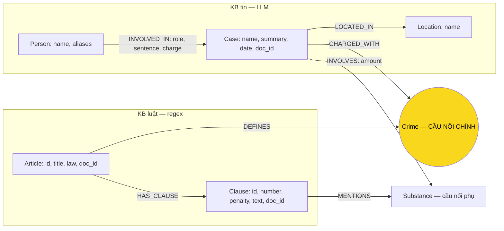

# Thiết kế Ontology — Day 19

**Họ tên:** Chu Văn Nhân  **MSSV:** 2A202602668

**Lựa chọn** (đánh dấu một):
- [x] Dùng ontology gợi ý (có thể chỉnh nhỏ)
- [ ] Tự thiết kế (xét bonus +15, xem `SUBMISSION.md`)

Thiết kế trước khi làm KG-1–KG-4. Tài liệu chọn schema và các hàm HINT trong `src/graph.py`. KG-1–KG-4 đã triển khai. Không sửa file test.

Kiểm chứng KG-1/KG-2 ngày 05-10-2026: 5 test `LinkEntity` đạt. `python bench_kg.py --build --limit 2` nạp 18 điều luật và 2 bài tin bằng Ollama Cloud `gpt-oss:120b`: 148 node, 294 cạnh, 2 lần gọi LLM, 7,8 giây. Có đủ 7 label, 7 type cạnh và 7 uniqueness constraint; không có node thiếu `doc_id`. Truy vấn `shortestPath` theo yêu cầu trả 5 đường xuyên KB dài 3–4 cạnh. Gemini được chọn cho embedding nhưng lệnh dựng graph không gọi embedding. USD hiển thị 0 chưa tính phí gói Ollama.

Kiểm chứng KG-3/KG-4 ngày 05-10-2026: đã thử Cypher trong Neo4j Browser trước khi đưa vào Python; vụ Lê Minh Thành nối qua `Crime` tới Điều 251, trả khoản 1–4 (khoản 1 hoặc khoản nhắc chất của vụ). `context` giữ toàn văn khoản, tóm tắt vụ và cạnh seed, ưu tiên cơ sở luật trong giới hạn `max_facts`; điều được hỏi trực tiếp hoặc tài liệu luật được truy hồi cũng được mở rộng. `GraphRAGAgent.answer` dùng cùng vector top-k như Flat RAG, gom `doc_id`, ghép dữ kiện graph và chunk vào prompt. `pytest tests/ -q` đạt 51 test (48 test lab + 3 test provider đã có từ bước cấu hình Ollama); không sửa file test trong bước KG-3/KG-4. `python bench_kg.py --check` in đủ 7 dòng `[OK]`, `context` có 23 dữ kiện và Điều 251. Kiểm tra thêm trên Neo4j đạt cho mức án 36 tháng, khung 02–07 năm, giới hạn dữ kiện, định nghĩa tiền chất Q1 và điều luật được hỏi trực tiếp. Lệnh `--check` thay graph trước đó bằng graph luật + một bài tin, vẫn giữ trong Neo4j; Benchmark đầy đủ Q1–Q6 đã chạy sau kiểm tra này; kết quả cuối ghi bên dưới.

Kiểm chứng đầy đủ ngày 05-10-2026: `python bench_kg.py --judge` dùng chat/judge Ollama Cloud `gpt-oss:120b` và embedding local `bge-m3`, nạp 18 điều luật + 20 bài báo, 176 chunk. Graph cuối có **209 node / 387 cạnh**: Article 18, Clause 99, Crime 13, Substance 12, Person 45, Case 15, Location 7. Recall trung bình Flat/Graph cùng 0.38; judge 1.17/1.67. Graph cải thiện Q3/Q5 nhưng sai mức tối đa Q4; tên chất khác hoa/thường vẫn tạo node trùng. Chi tiết và bằng chứng trong [REPORT_KG.md](REPORT_KG.md), số liệu gốc trong [benchmark](../ket_qua_benchmark_kg.txt). Ba ảnh Neo4j được chụp từ graph cuối; Q-D chọn Cái Quang Huy. Số liệu 148 node ở trên là graph kiểm tra nhỏ, không phải graph nộp cuối.

Mọi node được tạo có `doc_id = Document.id` của tài liệu tạo đầu tiên. Với node dùng chung (`Crime`, `Substance`, `Person`, `Location`), dùng `ON CREATE SET` để giữ nguồn tạo khi `MERGE` từ tài liệu khác; không tạo bản sao theo tài liệu vì sẽ phá cầu nối. Một `doc_id` không biểu diễn đầy đủ tất cả nguồn của node dùng chung.

### Khảo sát hai KB

Đã đọc [Điều 251 BLHS](../data/drug_law/blhs-dieu-251.md), [6 câu benchmark](../data/benchmark_kg.json) và bốn bài tin sau:

| Bài tin | Thực thể, quan hệ quan sát được | Câu liên quan |
| --- | --- | --- |
| [Vận chuyển ma túy từ Berlin](../data/drug_news/news-100260917203001265.md) | Cái Quang Huy, Nguyễn Tiến Đạt; vụ vận chuyển qua Nội Bài; tội vận chuyển; hơn 9,6kg MDMA, khoảng 406g Ketamine; truy tố, truy nã, dự kiến xét xử | Q5, Q6 |
| [Lê Minh Thành và ba thanh niên](../data/drug_news/news-100260918080821054.md) | Thành bị tuyên 36 tháng tù về tội mua bán; Kiên, Tuấn, Hưng mỗi người 24 tháng; MDMA được giám định; kháng cáo và hoãn phiên phúc thẩm | Q3, Q6 |
| [Đường dây hơn 36kg](../data/drug_news/news-100260928173914514.md) | Trần Thanh Tuấn, Trần Minh Tâm bị tuyên tử hình; TAND TP.HCM, ngày 28-9; cùng vụ có người bị xử về tội tổ chức sử dụng | Q2 |
| [Bắt Hoàng Nato](../data/drug_news/news-100260920221957595.md) | Dương Minh Tuấn có biệt danh Hoàng Nato; bị bắt để điều tra hành vi tổ chức sử dụng; TP.HCM; chuyên án gồm nhiều đường dây | Q4 |

Đối chiếu thêm [Điều 2 Luật PCMT](../data/drug_law/pcmt-dieu-2.md) cho Q1, [Điều 250 BLHS](../data/drug_law/blhs-dieu-250.md) cho Q5, [Điều 255 BLHS](../data/drug_law/blhs-dieu-255.md) cho Q4 và đoạn thu giữ MDMA trong [bài Viện Pháp y tâm thần](../data/drug_news/news-100260924105118645.md) cho Q6.

| Thứ / quan hệ | KB luật | KB tin | Có ở cả hai? / cách biểu diễn |
| --- | --- | --- | --- |
| Tội danh / hành vi bị điều tra, truy tố, xét xử | Điều luật định nghĩa tội | Vụ việc, người liên quan có tội danh được nêu | **Có**: `Crime`, cầu nối chính |
| Chất ma túy | MDMA, Heroine, Ketamine hoặc nhóm chất tùy điều | Chất thu giữ, giám định | **Có**: `Substance`, cầu nối phụ theo chất |
| Hình phạt | Khung phạt theo khoản | Mức án được tuyên cho từng người | **Có về khái niệm**, nhưng khác nghĩa: `Clause.penalty` và `INVOLVED_IN.sentence`, không gộp |
| Khối lượng | Ngưỡng định lượng theo chất, điểm, khoản | Khối lượng tang vật / trách nhiệm được nêu | **Có**, nhưng baseline giữ văn bản: `Clause.text` và `INVOLVES.amount` |
| Người, biệt danh, vai trò | Người phạm tội nói chung, không phải cá nhân xác định | Họ tên, biệt danh, bị cáo, nghi phạm | `Person` chỉ trích cá nhân từ tin |
| Vụ việc, địa điểm, ngày | Quy phạm chung | Vụ cụ thể, nơi xảy ra / xét xử | `Case`, `Location` từ tin |
| Điều, khoản, định nghĩa tiền chất | Cấu trúc và định nghĩa trong luật | Không đủ nội dung định nghĩa pháp lý | `Article`, `Clause` từ luật; chưa có `LegalTerm` |
| Điều định nghĩa tội; điều có khoản; khoản nhắc chất | Có | Không phải quan hệ chính trong tin | `DEFINES`, `HAS_CLAUSE`, `MENTIONS` |
| Người tham gia vụ; vụ có tội danh, chất, địa điểm | Không có vụ cụ thể | Có | `INVOLVED_IN`, `CHARGED_WITH`, `INVOLVES`, `LOCATED_IN` |

## 1. Sơ đồ

## 2. Entity types (node labels)

| Label | Ý nghĩa | Khóa định danh (`MERGE` theo) | Properties | Lấy từ KB nào | Trích bằng (regex / LLM / khác) |
| --- | --- | --- | --- | --- | --- |
| `Article` | Một điều trong một luật | `id` = metadata `article`, ví dụ `Điều 251 BLHS`; phải có tên luật, không dùng riêng số 251 | `id`, `title`, `law`, `doc_id` | Luật | Metadata + regex qua `parse_law_article` |
| `Clause` | Một khoản thuộc điều | `id` = `<Article.id> khoản <number>` | `id`, `number`, `penalty`, `text`, `doc_id` | Luật | Regex đầu khoản và dòng hình phạt; giữ toàn văn khoản |
| `Crime` | Tội danh chuẩn | `name` chuẩn từ tiêu đề điều BLHS | `name`, `doc_id` nguồn tạo đầu tiên | **Cả hai** | Luật: chuẩn hóa tiêu đề; tin: LLM chọn từ danh sách chuẩn, rồi `link_entity` |
| `Substance` | Chất được gọi tên cụ thể | `name` theo danh sách `SUBSTANCES` khi khớp | `name`, `doc_id` nguồn tạo đầu tiên | **Cả hai** | Luật: tìm tên trong văn bản; tin: LLM theo danh sách chuẩn |
| `Person` | Cá nhân trong tin, không phải người phạm tội giả định trong luật | `name` đầy đủ như bài báo | `name`, `aliases`, `doc_id` nguồn tạo đầu tiên | Tin | LLM; biệt danh lưu trong `aliases`, không tự tạo người thứ hai |
| `Case` | Vụ việc được bài báo mô tả | `name` do LLM đặt; thiếu tên dùng tiêu đề / `doc_id` theo HINT | `name`, `summary`, `date`, `doc_id`, `source_title` | Tin | LLM; metadata để truy nguồn |
| `Location` | Địa điểm vụ việc | `name` do LLM trích, dùng cách viết nhất quán khi có thể | `name`, `doc_id` nguồn tạo đầu tiên | Tin | LLM |

Code dùng `suggested_constraints` để tạo uniqueness constraint trên từng khóa trên, `add_law_article` và `add_news_case` để ghi graph. Constraint ngăn hai node có **cùng khóa**, không bảo đảm hai cách viết khác nhau thuộc cùng thực thể. Không tuyên bố khóa tên của `Person`/`Case` đã giải quyết trùng người hoặc trùng vụ; đây là giới hạn chấp nhận khi dùng gợi ý.

## 3. Relationships

| Type | Từ → Đến | Properties trên cạnh | Ý nghĩa |
| --- | --- | --- | --- |
| `DEFINES` | `Article` → `Crime` | Không | Điều BLHS định nghĩa tội danh; điều giải thích thuật ngữ không ép thành tội |
| `HAS_CLAUSE` | `Article` → `Clause` | Không | Khoản thuộc điều, số khoản chỉ có nghĩa trong điều đó |
| `MENTIONS` | `Clause` → `Substance` | Không | Khoản nhắc chất; **không** khẳng định khoản tự động áp dụng cho mọi vụ có chất đó |
| `INVOLVED_IN` | `Person` → `Case` | `role`, `sentence`, `charge` | Vai trò, mức án được nêu và tội danh riêng của người trong vụ; chưa có án thì `sentence` rỗng |
| `CHARGED_WITH` | `Case` → `Crime` | Không | Tội danh / hành vi được nguồn nêu cho vụ; không phải kết luận mọi người trong vụ đều phạm tội này |
| `INVOLVES` | `Case` → `Substance` | `amount` | Khối lượng nguyên văn, giữ “hơn”, “gần”, “khoảng”, đơn vị; không cộng các lô hay suy ra khối lượng cá nhân tùy tiện |
| `LOCATED_IN` | `Case` → `Location` | Không | Địa điểm nguồn nêu; baseline chưa phân loại nơi bắt giữ, nơi xét xử, nơi cư trú |

Dùng `MERGE` cạnh theo hai đầu và type như HINT; không tạo node hình phạt riêng. Khi một vụ có nhiều tội, cần đối chiếu `INVOLVED_IN.charge` với `Crime.name` để không gán nhầm tội của đồng bị cáo.

## 4. Node cầu nối giữa 2 KB

- **Node chính:** `Crime`. Đường nối: `(Person)-[:INVOLVED_IN]->(Case)-[:CHARGED_WITH]->(Crime)<-[:DEFINES]-(Article)-[:HAS_CLAUSE]->(Clause)`.
- **Vì sao:** Tin cho biết người, vụ, mức án nhưng không đủ khung luật; luật tổ chức theo tội danh nhưng không có người/vụ cụ thể. Tội danh chung nối hai phần này cho Q3–Q5.
- **Cầu phụ:** `Substance` nối chất trong vụ với khoản nhắc chất. Hữu ích cho Q5/Q6 nhưng không thay được cầu `Crime`: MDMA xuất hiện trong nhiều tội và nhiều khoản.
- **Khớp tên:** Dùng `normalize_crime` bỏ tiền tố “tội”, hạ chữ, gộp khoảng trắng; danh sách tội chuẩn lấy từ các điều BLHS và đưa vào prompt. Khi làm KG-1, `link_entity` chuẩn hóa hai phía, khớp chính xác trước rồi mới dùng độ gần với ngưỡng 0,8; trả lại tên chuẩn hoặc `None`. KG-1 đã triển khai theo quy tắc này và đạt 5 test `LinkEntity`; chưa coi kiểm thử đó là bằng chứng graph thực tế đã nối được.
- **Cầu gãy:** Tên tội rút gọn, sai chính tả, nhầm mua bán với vận chuyển hoặc không có trong luật được nạp. Không tự gán tội gần nhất khi không chắc; giữ nguồn trong chunk, kiểm tra thủ công và báo không đủ dữ kiện. Biệt danh “Hoàng Nato” cần gắn vào Dương Minh Tuấn.
- **Chất:** Ưu tiên tên chuẩn MDMA/Ketamine khi nguồn có giám định. Không mặc định “kẹo”/“thuốc lắc” luôn là MDMA. HINT chưa có bảng đồng nghĩa đầy đủ; `etomidate` không có trong danh sách chuẩn hiện tại, không ép sang chất khác.

## 5. Competency questions

Các pattern dưới đây mô tả truy vấn cần làm, chưa phải kết quả thực thi. `$case_name` là tên vụ thực tế sau trích xuất, chọn bằng `doc_id`, tiêu đề, ngày và nội dung nguồn; không giả định LLM luôn đặt một tên cố định.

| Câu | Đường đi (Cypher pattern) | Trả lời được? |
| --- | --- | --- |
| **Q1:** Tiền chất là gì? | `(a:Article {doc_id:'pcmt-dieu-2'})-[:HAS_CLAUSE]->(cl:Clause {number:4})`; đọc `cl.text` | **Có bằng đọc văn bản khoản**, không bằng node định nghĩa có cấu trúc. Khoản 4 chứa định nghĩa; schema không có `LegalTerm` hay cạnh `DEFINES_TERM`. Nếu KG-3 chưa đưa `cl.text` vào ngữ cảnh thì dùng chunk luật, không dựa vào `penalty` rỗng. |
| **Q2:** Ai bị tử hình trong vụ hơn 36kg, ngày 28-9 tại TP.HCM? | `(p:Person)-[r:INVOLVED_IN]->(k:Case {name:$case_name})-[:LOCATED_IN]->(l:Location)`; kiểm tra nguồn `news-100260928173914514`, ngày xét xử, nơi và `r.sentence = 'tử hình'` | **Có nếu trích đúng**: Trần Thanh Tuấn, Trần Minh Tâm. Không lấy người từ vụ khác chỉ vì cùng địa điểm hoặc tên gần nhau. |
| **Q3:** Lê Minh Thành bị bao nhiêu tháng, tội gì, điều và khung cơ bản? | `(p:Person {name:'Lê Minh Thành'})-[r:INVOLVED_IN]->(k:Case)-[:CHARGED_WITH]->(c:Crime)<-[:DEFINES]-(a:Article)-[:HAS_CLAUSE]->(cl:Clause {number:1})`; đối chiếu `r.charge = c.name` | **Có nếu cầu nối đúng**: `r.sentence` = 36 tháng tù; tội mua bán; Điều 251; `cl.penalty` = 02 năm đến 07 năm. Khung cơ bản không phải khẳng định khoản đã dùng để tuyên án. |
| **Q4:** Hoàng Nato bị bắt về hành vi gì, khung cao nhất? | `(p:Person)-[r:INVOLVED_IN]->(k:Case)-[:CHARGED_WITH]->(c:Crime)<-[:DEFINES]-(a:Article)-[:HAS_CLAUSE]->(cl:Clause)`; tìm `'Hoàng Nato' IN p.aliases`, khớp `r.charge`, đọc khoản hình phạt chính cao nhất | **Có nếu alias/tội đúng**: Dương Minh Tuấn bị bắt để điều tra hành vi tổ chức sử dụng; Điều 255 khoản 4 có 20 năm hoặc chung thân. Không gọi đây là án đã tuyên, không chọn khoản có số lớn nhất một cách máy móc. |
| **Q5:** Cái Quang Huy, chất và khoản theo khối lượng MDMA? | `(p:Person {name:'Cái Quang Huy'})-[r:INVOLVED_IN]->(k:Case)-[v:INVOLVES]->(s:Substance {name:'MDMA'})`; đồng thời `(k)-[:CHARGED_WITH]->(c:Crime)<-[:DEFINES]-(a:Article)-[:HAS_CLAUSE]->(cl:Clause)-[:MENTIONS]->(s)`; lấy thêm các chất của `k`, đối chiếu tội cá nhân | **Một phần bằng cấu trúc, đủ đáp án khi đọc nguồn luật và so sánh ngoài graph.** Tội vận chuyển, Điều 250; hơn 9,6kg MDMA và khoảng 406g Ketamine. Hơn 9,6kg là hơn 9.600g, vượt ngưỡng 100g tại điểm b khoản 4: 20 năm, chung thân hoặc tử hình. `amount` là chuỗi và `MENTIONS` nối nhiều khoản; schema chưa có ngưỡng số để Cypher tự chọn khoản. Đây là đối chiếu khung theo dữ kiện câu hỏi, không xác nhận phán quyết thực tế. |
| **Q6:** Những vụ nào liên quan MDMA? | `(k:Case)-[:INVOLVES]->(:Substance {name:'MDMA'})`; `RETURN DISTINCT k.name, k.doc_id, k.summary`; lấy người qua `(p:Person)-[:INVOLVED_IN]->(k)` nếu cần | **Có nếu trích đầy đủ**: vụ Cái Quang Huy, vụ Lê Minh Thành, vụ Viện Pháp y tâm thần Trung ương. Kiểm tra toàn bộ corpus, không chỉ bốn bài khảo sát. `DISTINCT` chỉ khử node trùng kết quả, không gộp các tên khác nhau của cùng vụ. |

Q1 cần giữ `Clause.text` trong ngữ cảnh trả lời. Q5 cần nguyên văn `Clause.text`, `INVOLVES.amount` và phân biệt lượng toàn vụ với lượng quy trách nhiệm cho người; không dùng cạnh `MENTIONS` làm bằng chứng tự động áp dụng khoản.

## 6. Quyết định thiết kế và đánh đổi

1. **Chọn ontology HINT, không xét bonus.** Phương án khác: thêm node thuật ngữ, ngưỡng và sự kiện tố tụng. Gợi ý đủ đường nối cơ bản, phù hợp thời gian lab; chấp nhận Q1/Q5 còn phụ thuộc văn bản và suy luận có kiểm chứng.
2. **Chọn `Crime` làm cầu chính, `Substance` làm cầu phụ.** Chỉ nối qua chất dễ lấy sai điều vì cùng MDMA xuất hiện ở mua bán, vận chuyển, tàng trữ. Chọn điều theo tội trước rồi mới đọc khoản theo chất và khối lượng.
3. **Luật trích bằng regex, tin trích bằng LLM.** Dùng LLM cho cả hai tăng chi phí và nguy cơ bịa luật; regex cho cả tin khó xử lý câu văn, alias và nhiều bị cáo. Dùng cấu trúc điều/khoản ổn định cho luật, giữ nguồn để kiểm chứng kết quả tin.
4. **Giữ khóa và constraint của HINT.** Phương án khác: khóa người theo hồ sơ, vụ theo ID sự kiện liên tài liệu. Baseline chưa có dữ liệu định danh đủ tin cậy; `Article.id`/`Clause.id` rõ phạm vi, còn `Person.name`/`Case.name` là giới hạn cần công khai, không phải giải pháp chống trùng hoàn chỉnh.
5. **Mức án và tội cá nhân nằm trên `INVOLVED_IN`.** Đặt mức án trên `Case` sẽ gán tử hình cho cả sáu bị cáo Q2. Giữ `charge` trên cạnh để phân biệt hai tội trong cùng vụ; chưa mô hình hóa nhiều tội / nhiều bản án cho cùng một người trong một vụ.
6. **Giữ khối lượng và trạng thái tố tụng theo nguồn, không suy đoán.** Phương án khác: tự đổi mọi đơn vị, tổng hợp lô và gán trạng thái phán quyết. Giữ “hơn/gần/khoảng”, mức án rỗng nếu chưa tuyên; khi Q5 cần đổi kg sang g phải làm rõ phép đổi và kiểm tra nguồn. `role` không thay được lịch sử tố tụng có thời điểm.

## 7. So với ontology gợi ý (bắt buộc nếu xét bonus)

Không xét bonus +15. Giữ nguyên bảy label và bảy relationship; không coi chuẩn hóa tên hoặc giải thích truy vấn là ontology mới. Chưa có Cypher thực thi hay số liệu benchmark chứng minh cải thiện.

| Điểm khác | Gợi ý làm gì | Bạn làm gì | Vấn đề nó giải quyết | Bằng chứng (Cypher, hoặc số liệu benchmark) |
| --- | --- | --- | --- | --- |
| Không đổi schema | `Crime` nối luật và tin; khóa tên cho người/vụ; khối lượng dạng chuỗi | Dùng các hàm HINT khi làm KG-2; thiết kế quy tắc kiểm tra tội cá nhân và đọc văn bản cho Q1/Q5 | Làm rõ phạm vi sử dụng và tránh kết luận quá mức; không giải quyết các điểm yếu cấu trúc | Pattern dự kiến ở mục 5, chưa phải bằng chứng chạy thực tế |

## 8. Hạn chế còn lại

- Tên người trùng hoặc cách viết khác nhau có thể gộp sai / tách sai. Tên vụ do LLM đặt có thể khác giữa lần chạy và giữa bài cùng vụ; `doc_id` giúp truy nguồn nhưng không phải khóa vụ trong HINT.
- Một node vụ chỉ lưu một `doc_id`, `summary`, `date`; một cạnh người–vụ chỉ lưu một `charge`/`sentence`. Upsert nguồn khác có thể ghi đè dữ kiện; chưa có provenance theo từng nhận định.
- Chưa có bảng đồng nghĩa chất đầy đủ. Không suy ra MDMA từ tên lóng khi không có xác nhận; tên thuốc / hỗn hợp và etomidate cần kiểm tra riêng.
- Chưa có `LegalTerm` cho định nghĩa tiền chất, chưa có node điểm luật / ngưỡng có đơn vị và cận đóng/mở. Q1 đọc văn bản; Q5 không thể chọn khoản bằng so sánh số thuần Cypher với schema này.
- Chưa phân biệt đầy đủ điều tra, truy tố, sơ thẩm, phúc thẩm và bản án có hiệu lực. Khung hình phạt luật không phải án cá nhân; bị bắt không đồng nghĩa đã bị kết tội.
- Thu thập tin có đoạn gợi ý bài liên quan ở cuối. Khi trích xuất cần tách dữ kiện bài chính khỏi teaser; không biến vụ Berlin xuất hiện ở cuối bài Thành thành cùng vụ.
- Dữ liệu luật là BLHS 2015 sửa đổi 2017 theo metadata, không tự khẳng định là luật hiện hành ở ngày trả lời. Khóa điều hiện tại không tách phiên bản; cần thiết kế lại nếu nạp nhiều phiên bản luật.
- Đáp án phụ thuộc chất lượng LLM, KG-1–KG-4 và việc đưa văn bản vào ngữ cảnh. Tài liệu này không chứng minh benchmark đã đạt Q1–Q6; cần kiểm chứng sau khi code, không sửa file test để ép kết quả.
